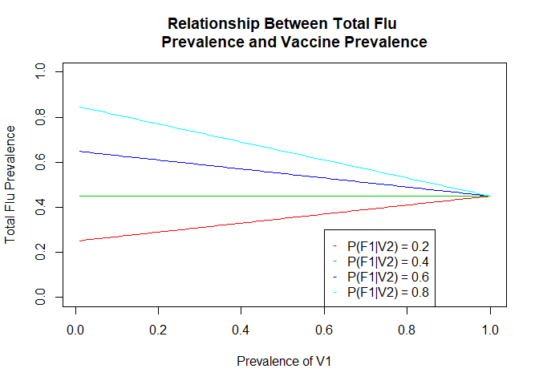
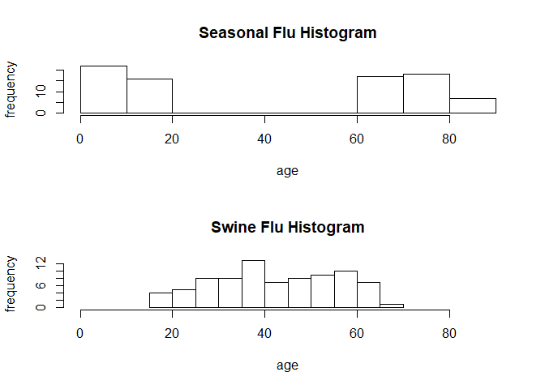

Assignment 1
================
Troy Yang, Becky Lynskey

### Statement of Author contributions

We worked through the lab together at all times while working on this. Short answer responses were always talked through before writing anything, and whenever there was disagreement we aways made sure to come to a concensus first. Troy wrote most of the code, but things were always talked through beforehand. When we had issues and needed the TA's help, Becky went to office hours as Troy has class during that time.

Problem 1
---------

### Question 1

``` r
p_f2 <- 0.003
p_f1_not_f2 <- 0.001
p_f1_f2 <- 0.001
p_not_f2 <- 1 - p_f2

p_f1 <- p_f2 * p_f1_f2 + p_not_f2 * p_f1_not_f2

independent <- p_f1_f2 * p_f2 == p_f1 * p_f2
```

Based on these values, the swine and seasonal flu are independent, as p(f1 and f2) == p(f1) \* p(f2). We used the law of total probability and and the multiplication rule to reach this conclusion.

### Question 2

Because swine and seasonal flu are independent of each other, the likelihood of contracting one flu does not effect the likelihood of contracting the other. The immune responses to the seasonal and swine flu strains are probably different.

### Question 3

``` r
f2 <- c(.2,.4,.6,.8)
p_d_not_f2 <- seq(.01, .5, length.out = 100)
p_f2_d <- matrix(NA, nrow = length(f2), ncol = length(p_d_not_f2))
for(i in 1:length(f2)) {
  for (j in 1:length(p_d_not_f2)) {
    p_f2_d[i,j] <- (f2[i] * .7)/((f2[i] * .7) + ((1-f2[i]) * p_d_not_f2[j]))
    
  }
}
```

### Question 4

``` r
plot(p_d_not_f2,p_f2_d[1,], type = "line", col = 2, ylim = c(0,1), main = "Relationship Between False detection rate and Probability 
     of Swine Flu given Detection", xlab = "False Detection Rate", ylab = "Probability Swine Flu Given Detection")
```

    ## Warning in plot.xy(xy, type, ...): plot type 'line' will be truncated to
    ## first character

``` r
lines(p_d_not_f2,p_f2_d[2,], col = 3)
lines(p_d_not_f2,p_f2_d[3,], col = 4)
lines(p_d_not_f2,p_f2_d[4,], col = 5)
abline(a = 0.5, b = 0)
legend(0.1, 0.3, legend = c("P(F2) = 0.2","P(F2) = 0.4","P(F2) = 0.6","P(F2) = 0.8"),
       col = c(2,3,4,5), pch = "-")
```


The line at 0.5 represents the boundry where you're just as likely to have the swine flu as not given the swine flu was detected.

### Question 5

As false detection rate increases, the true swine flu detection rate (P(F2|D)) decreases. This effect is consistent accross all levels of the probability of having the swine flu (P(F2)). However, for lower values of probability of swine flu, the drop off is more dramatic, and for higher levels of probability of swine flu, the drop off is less dramatic. The drop off in the teal curve is much smaller than the drop off in the red curve, showing that increased prevalence in the swine flu mitigates the effect of false detection rate.

### Question 6

From a clinical perspective, the figure suggests that the effectiveness of the detection protocol for the swine flu is dependent on the prevalence of the swine flu. If the swine flu is more prevalent, than the detection protocol is more effective. If the swine flu is less prevalent, then the detection protocol is less effective. The area above the 0.5 line represents where the detection protocol is actually helpful (better than 50/50 chance). As most of the curves are above the 0.5 line, the detection protocol seems to be mostly helpful.

### Question 7

``` r
p_f1_v2 <- c(.2,.4,.6,.8)
p_v1 <- seq(.01, 1, length.out = 100)
p_v2 <- 1 - p_v1
p_f1_v1 <- .05
p_f2_v2 <- .05
p_f2_v1 <- .4
p_f1 <- matrix(NA, nrow = length(p_v1), ncol = length(p_f1_v2))
p_f2 <- matrix(NA, nrow = length(p_v1), ncol = length(p_f1_v2))

for(i in 1:length(p_f1_v2)) {
  p_f1[,i] <- p_f1_v1 * p_v1 + p_f1_v2[i] * p_v2
  p_f2[,i] <- p_f2_v1 * p_v1 + p_f2_v2 * p_v2
}

total_p <- p_f1 + p_f2
```

### Question 8

``` r
plot(p_v1, total_p[,1], main = "Relationship Between Total Flu 
     Prevalence and Vaccine Prevalence", xlab = "Prevalence of V1", ylab = "Total Flu Prevalence", ylim = c(0,1), col = 2, type = "line")
```

    ## Warning in plot.xy(xy, type, ...): plot type 'line' will be truncated to
    ## first character

``` r
lines(p_v1, total_p[,2], col = 3)
lines(p_v1, total_p[,3], col = 4)
lines(p_v1, total_p[,4], col = 5)
legend(0.6, 0.3, legend = c("P(F1|V2) = 0.2","P(F1|V2) = 0.4","P(F1|V2) = 0.6","P(F1|V2) = 0.8"),
       col = c(2,3,4,5), pch = "-")
```



### Question 9

When V2 is effective on F1 (teal and blue lines), it is actually better to have all V1, as the total prevalence is the lowest with all V1 and no V2. However, when V2 is not effective on F1 (green and red lines), it is better to have all V1, and no V2. Either all V1 or all V2 is always going to be better than a mixed strategy.

Problem 2
---------

### Question 1

Ho: Flu and swine flu impact the same age groups Ha: Flu and swine flu impact different age groups

``` r
d1 <- read.csv(file = "http://faraway.neu.edu/data/assn1_dataset1.csv")
```

### Question 2

``` r
mean_age <- aggregate(age ~ flu, data = d1, FUN = mean)

range_calc <- function(x) {
  return(max(x) - min(x))
}

range_age <- aggregate(age ~ flu, data = d1, FUN = range_calc)
```

While the mean ages of those afflicated by the seasonal and swine flus were largely the same (43.36 vs. 42.78), the range of age was not (84 vs. 49). Based on the range, the distribution of the ages of those affected by the seasonal flu is much wider (effects more old and young people) than the swine flu (more middle aged people).

### Question 3

``` r
par(mfrow=c(2,1))
hist(d1$age[d1$flu=="seasonal"], xlim = c(0,90), main = "Seasonal Flu Histogram", ylab = "frequency", xlab = "age")
hist(d1$age[d1$flu=="swine"], xlim = c(0,90),main = "Swine Flu Histogram", ylab = "frequency", xlab = "age")
```



### Question 4

Based on the side by side histograms, it appears that the two different flus target two different portions of the population. The seasonal flu appears to target largely the young (&lt;20) and the eldery (&gt;60), while the swine flu seems to target middled aged people (20 &lt; age &lt; 65).

### Question 5

``` r
not_middle_counter <- function(x) {
  length(x[x > 65 | x < 18])
}

middle_counter <- function(x) {
  length(x[x <= 65 & x >= 18])
}

count_middle <- aggregate(age ~ flu, data = d1, FUN = middle_counter)

count_not_middle <- aggregate(age ~ flu, data = d1, FUN = not_middle_counter)

flu_table <- data.frame(count_middle$age, count_not_middle$age)


rownames(flu_table) <- c("Seasonal", "Swine")
colnames(flu_table) <- c("Mid Aged", "Old & Young")
```

### Question 6

``` r
mosaicplot(flu_table)
```

 The patterns in the plot do not support the hypothesis. That is because it is clear from the mosiac plot that the seasonal flu and swine flu had very different proportions when it came to the age groups. The seasonal flu was largely dominated Old & Young, while swine flu was mostly Mid Aged.

### Question 7

``` r
chisq.test(flu_table)
```

    ## 
    ##  Pearson's Chi-squared test with Yates' continuity correction
    ## 
    ## data:  flu_table
    ## X-squared = 122.98, df = 1, p-value < 2.2e-16

The P value is less than 0.05, thus we reject the null, which states that both types of flu impact the same age groups. It is extremely unlikely that the flu type and age group variables are independent.
