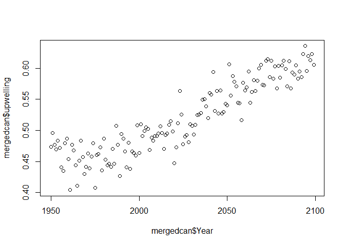

Assignment 3
================
Troy Yang, Becky Lynskey, Sydney Lehman

### Statement of Author contributions

We worked through the lab together at all times while working on this. Short answer responses were always talked through before writing anything, and whenever there was disagreement we aways made sure to come to a concensus first. Troy wrote most of the code, but things were always talked through beforehand. When we had issues and needed the TA's help, Becky went to office hours as Troy has class during that time.

Problem 1
=========

``` r
#Data
benguela.upw <- read.csv("http://faraway.neu.edu/data/assn4_upwelling_benguela.csv")
california.upw <- read.csv("http://faraway.neu.edu/data/assn4_upwelling_california.csv")
canary.upw <- read.csv("http://faraway.neu.edu/data/assn4_upwelling_canary.csv")
humboldt.upw <- read.csv("http://faraway.neu.edu/data/assn4_upwelling_humboldt.csv")

benguela.tmp <- read.csv("http://faraway.neu.edu/data/assn4_temperature_benguela.csv")
california.tmp <- read.csv("http://faraway.neu.edu/data/assn4_temperature_california.csv")
canary.tmp <- read.csv("http://faraway.neu.edu/data/assn4_temperature_canary.csv")
humboldt.tmp <- read.csv("http://faraway.neu.edu/data/assn4_temperature_humboldt.csv")
```

This code is to import the datasets that are going to be analyzed. \#1

``` r
benupwrm <- data.frame(rowMeans(benguela.upw[,c(1:22)]))
names(benupwrm) <- "upwelling"
zBen <- data.frame(benguela.upw$year)
names(zBen) <- "Year"
benupw <- cbind(benupwrm, zBen)

calupwrm <- data.frame(rowMeans(california.upw[,c(1:22)]))
names(calupwrm) <- "upwelling"
zCal <- data.frame(california.upw$year)
names(zCal) <- "Year"
calupw <- cbind(calupwrm, zCal)

canupwrm <- data.frame(rowMeans(canary.upw[,c(1:22)]))
names(canupwrm) <- "upwelling"
zBen <- data.frame(canary.upw$year)
names(zBen) <- "Year"
canupw <- cbind(canupwrm, zBen)

humupwrm <- data.frame(rowMeans(humboldt.upw[,c(1:22)]))
names(humupwrm) <- "upwelling"
zBen <- data.frame(humboldt.upw$year)
names(zBen) <- "Year"
humupw <- cbind(humupwrm, zBen)

bentmprm <- data.frame(rowMeans(benguela.tmp[,c(1:22)]))
names(bentmprm) <- "temp"
xBen <- data.frame(benguela.tmp$year)
names(xBen) <- "Year"
bentmp <- cbind(bentmprm, xBen)

caltmprm <- data.frame(rowMeans(california.tmp[,c(1:22)]))
names(caltmprm) <- "temp"
xCal <- data.frame(california.tmp$year)
names(xCal) <- "Year"
caltmp <- cbind(caltmprm, xCal)

cantmprm <- data.frame(rowMeans(canary.tmp[,c(1:22)]))
names(cantmprm) <- "temp"
xBen <- data.frame(canary.tmp$year)
names(xBen) <- "Year"
cantmp <- cbind(cantmprm, xBen)

humtmprm <- data.frame(rowMeans(humboldt.tmp[,c(1:22)]))
names(humtmprm) <- "temp"
xBen <- data.frame(humboldt.tmp$year)
names(xBen) <- "Year"
humtmp <- cbind(humtmprm, xBen)


mergedben <- merge(benupw,bentmp)
mergedcal <- merge(calupw,caltmp)
mergedcan <- merge(canupw, cantmp)
mergedhum <- merge(humupw,humtmp)
```

This code starts off by taking the mean upwelling values or mean temperatures per year using the rowmean function, then naming the extracted column either upwelling or temperature. Year is pulled from the original datasets using $ and consequently named year. Next, the row means and years are combined using cbind between the two data frames. Finally, the individual upwelling and temperature dataframes are combined into 1 dataframe using the merge function. \#2

``` r
mergedben ["System"] <- "Benguela"
mergedcal ["System"] <- "California"
mergedcan ["System"] <- "Canary"
mergedhum ["System"] <- "Humboldt"
Done <- rbind(mergedben, mergedcal, mergedcan, mergedhum)
Done$System <- as.factor(Done$System)
```

A column labeled system was added to each of the EBCS dataframes containing the respective system. All dataframes were merged into a single data frame named Done using the rbind function and then system was designated as a factor.

1.  The best approach for relating upwelling means to the year for each EBCS would be a linear regression model for each EBCS. This is because we are looking for a casual relationship between year (explanatory numerical variable) and upwelling (numerical response variable) in each EBCS.

2.  Linear Regression assumes that the relationship between the explanatory and response variable should be the same, homoscedacity (constant variance), normally distributed residuals, and independent and non autocorrelated residuals. There is also an assumption that there is a linear relationship between the response and explanatory variables. The null hypothesis is that the slope for the relationship is 0. This hypothesis is the same for each ECBS. The alternate would be that the slope is not 0.

``` r
#Humboldt
#Make linear model
lmben <- lm(mergedben$upwelling ~ mergedben$Year, data = mergedben)
#Test for residual normality
shapiro.test(lmben$residuals)
```

    ## 
    ##  Shapiro-Wilk normality test
    ## 
    ## data:  lmben$residuals
    ## W = 0.98808, p-value = 0.229

``` r
#Independent and non-correlated residuals?
acf(lmben$residuals)
```


``` r
#linearity and  homoscedasticity?
par(mfrow = c(2,2))
plot(lmben)
```


``` r
#Further confirmed and visualized by solo qqplot
par(mfrow = c(1,1))
qqnorm(lmben$residuals)
qqline(lmben$residuals)
```


``` r
#Visualize relationship between variables
plot(mergedben$Year, mergedben$upwelling)
```

 To start off a shapiro-wilkes test was used to test for the normality of the residuals and yielded a p-value of .229 failing to reject the null of normality. Using the acf function on the residuals they seem to be independent and lack autocorrelation as there is very little extension of the lag out of the ACF range. Moreover, the plotted residuals do not show any trend indicating linearity and the constant spread of residuals across fitted values indicates homoscedasticity. Finally, the qqplot of residuals further supports their normality and the plot of year vs upwelling indicates a positive linear relationship.From this data the assumptions of the linear model are largely upheld and support the linear regression analysis.

``` r
#California
lmcal <- lm(mergedcal$upwelling ~ mergedcal$Year, data = mergedcal)
shapiro.test(lmcal$residuals)
```

    ## 
    ##  Shapiro-Wilk normality test
    ## 
    ## data:  lmcal$residuals
    ## W = 0.98935, p-value = 0.3133

``` r
acf(lmcal$residuals)
```


``` r
par(mfrow = c(2,2))
plot(lmcal)
```


``` r
par(mfrow = c(1,1))
qqnorm(lmcal$residuals)
qqline(lmcal$residuals)
```


``` r
plot(mergedcal$Year, mergedcal$upwelling)
```


``` r
#Doesnt seem to have as strong of relationship
```

To start off a shapiro-wilkes test was used to test for the normality of the residuals and yielded a p-value of .3133 failing to reject the null of normality. Using the acf function on the residuals they seem to be independent and lack autocorrelation as there is no extension of the lag out of the ACF range. Moreover, the plotted residuals do not show any trend indicating linearity and the constant spread of residuals across fitted values indicates homoscedasticity. Finally, the qqplot of residuals further supports their normality and the plot of year vs upwelling indicates a very small positive linear relationship.From this data the assumptions of the linear model are largely upheld and support the linear regression analysis.

``` r
#Canary
lmcan <- lm(mergedcan$upwelling ~ mergedcan$Year, data = mergedcan)
shapiro.test(lmcan$residuals)
```

    ## 
    ##  Shapiro-Wilk normality test
    ## 
    ## data:  lmcan$residuals
    ## W = 0.99609, p-value = 0.9627

``` r
acf(lmcan$residuals)
```


``` r
par(mfrow = c(2,2))
plot(lmcan)
```


``` r
par(mfrow = c(1,1))
qqnorm(lmcan$residuals)
qqline(lmcan$residuals)
```


``` r
plot(mergedcan$Year, mergedcan$upwelling)
```

 To start off a shapiro-wilkes test was used to test for the normality of the residuals and yielded a p-value of .9627 failing to reject the null of normality. Using the acf function on the residuals they seem to be independent and lack autocorrelation as there is very little extension of the lag out of the ACF range. Moreover, the plotted residuals do not show any trend indicating linearity and the constant spread of residuals across fitted values indicates homoscedasticity. Finally, the qqplot of residuals further supports their normality and the plot of year vs upwelling indicates a positive linear relationship.From this data the assumptions of the linear model are largely upheld and support the linear regression analysis.

``` r
#Humboldt  
lmhum <- lm(mergedhum$upwelling ~ mergedhum$Year, data = mergedhum)
shapiro.test(lmhum$residuals)  
```

    ## 
    ##  Shapiro-Wilk normality test
    ## 
    ## data:  lmhum$residuals
    ## W = 0.98608, p-value = 0.1371

``` r
acf(lmhum$residuals)
```


``` r
par(mfrow = c(2,2))
plot(lmhum)
```


``` r
par(mfrow = c(1,1))
qqnorm(lmhum$residuals)
qqline(lmhum$residuals)
```


``` r
plot(mergedhum$Year, mergedhum$upwelling)  
```

 To start off a shapiro-wilkes test was used to test for the normality of the residuals and yielded a p-value of .1371 failing to reject the null of normality. Using the acf function on the residuals they seem to be independent and lack autocorrelation as there is very little extension of the lag out of the ACF range. Moreover, the plotted residuals do not show any trend indicating linearity and the constant spread of residuals across fitted values indicates homoscedasticity. Finally, the qqplot of residuals further supports their normality and the plot of year vs upwelling indicates a positive linear relationship.From this data the assumptions of the linear model are largely upheld and support the linear regression analysis.

``` r
sumben <- summary(lmben)
sumcal <- summary(lmcal)
sumcan <- summary(lmcan)
sumhum <- summary(lmhum)
```

This code summarizes the statistical values calculated by R for each EBCS linear model. The slopes for each linear regression are statistically significant.

5
=

``` r
plot(mergedben$Year, mergedben$upwelling, col = "red", ylim = c(0,1), xlab = "Year", ylab = "Mean Upwelling", main = "Temporal Upwelling Trends" )
points(mergedcal$Year, mergedcal$upwelling, col = "blue")
points(mergedcan$Year, mergedcan$upwelling, col = "green")
points(mergedhum$Year, mergedhum$upwelling, col = "black")
abline(lm(mergedben$upwelling~mergedben$Year),col = "red")
abline(lm(mergedcal$upwelling~mergedcal$Year),col = "blue")
abline(lm(mergedcan$upwelling~mergedcan$Year),col = "green")
abline(lm(mergedhum$upwelling~mergedhum$Year),col = "black")
legend("bottomleft", legend = c("Benguela", "California", "Canary", "Humboldt"), col = c("red", "blue", "green", "black"), lty = 1, cex = .8)
```

 This code plots the upwelling means for each EBCS by year and also the corresponding linear model.The points function was used to add the other EBCS while the abline function was used to add the linear regressions, the legend function was also used. The figure displays clear linear relationships between the year and mean upwelling for all 4 EBCS. Benguela has the highest mean upwelling values and seems to have a similar positive slope to Canary. Humboldt had the smallest y-intercept but seems to have the most positive slope and quickly crosses over the regression of California. California seems to have a clear linear relationship between year and mean upwelling but seemingly has a negligible slope as the mean upwelling seems to be consistently about .35. Overall, Benguela, Canary, and Humboldt all display clear positive relationships between year and increasing mean upwelling. \#6

``` r
benslope <- coef(sumben)[2,1:2]
calslope <- coef(sumcal)[2,1:2]
canslope <- coef(sumcan)[2,1:2]
humslope <- coef(sumhum)[2,1:2]

slopemat <- matrix(c(benslope[1], calslope[1], canslope[1], humslope[1]), ncol = 4, nrow = 1)


bpslope <- barplot(slopemat, main = "EBCS Linear Model Slopes", names.arg = c("Benguela", "Cali", "Canary", "Humboldt"), xlab = "EBCS", ylab = "Mean Upwelling/Year", ylim = c(0,.0017))

errormat <- matrix(c(benslope[2], calslope[2], canslope[2], humslope[2]), ncol = 4, nrow = 1)

#lower ci
lowc <- as.matrix(slopemat - (1.96*errormat))
#upper ci
highc <- as.matrix(slopemat + (1.96*errormat))

arrows(x0 = bpslope, x1 = bpslope, y0 = lowc, y1 = highc, angle = 90, len = .2, code = 3)
```

 The slopes for each EBCS were extracted from the coefficients of the summary of the linear models and then plotted in a barplot. 95% confidence intervals were added using 1.96\*SE and the arrows function. Based on the figure all 4 EBCS have statistically significant slopes given that all 95% CIs are greater than 0. This is also confirmed when looking at the p-values in the summaries of the linear models. With respect to differences in the slopes california clearly has a statistically different slope than the other 3 EBCS due to the lack of overlap between slope CIs. Benguela, Canary, and Humboldt all seem to have similar slopes with Humboldt on the higher end and Canary on the lower end. Benguela's CI overlaps both Humboldt and Canary so there would not be any statistically significant differences between the slopes of Benguela and Canary or Benguela and Humboldt. With respect to the comparison between the slopes of Canary and Humboldt, it is very difficult to determine whether there is an overlap by looking at the figure. The upper bound for Canary was calculated to be .00131 while the lower bound for Humboldt was calculated to be .00133 so using these values the slopes would be statistically different.

Problem 2

1.  The best approach for determining the consistency of climate change across EBCS would be an ANCOVA because we are looking for the relationship between EBCS and year with upwelling (categorical and numerical explanatory variable with numerical response variable respectively).

2.  Ho1: There is no difference between slopes for year across the different levels of EBCS. Ha1: There is a difference between slopes for year across the different levels of EBCS.

Ho2: There is no relationship between year and upwelling Ha2: There is a relationship between year and upwelling

Ho3: There is no difference between the adjusted mean of upwelling across different EBCS Ha3: There is a difference between the adjusted mean of upwelling across different EBCS

1.  

``` r
aov_ebcs <- aov(upwelling~Year*System, data = Done)
aov_ebcs
```

    ## Call:
    ##    aov(formula = upwelling ~ Year * System, data = Done)
    ## 
    ## Terms:
    ##                      Year    System Year:System Residuals
    ## Sum of Squares   1.172637 23.911354    0.310791  0.332231
    ## Deg. of Freedom         1         3           3       592
    ## 
    ## Residual standard error: 0.0236897
    ## Estimated effects may be unbalanced

``` r
summary(aov_ebcs)
```

    ##              Df Sum Sq Mean Sq F value Pr(>F)    
    ## Year          1  1.173   1.173  2089.5 <2e-16 ***
    ## System        3 23.911   7.970 14202.5 <2e-16 ***
    ## Year:System   3  0.311   0.104   184.6 <2e-16 ***
    ## Residuals   592  0.332   0.001                   
    ## ---
    ## Signif. codes:  0 '***' 0.001 '**' 0.01 '*' 0.05 '.' 0.1 ' ' 1

``` r
shapiro.test(aov_ebcs$residuals)
```

    ## 
    ##  Shapiro-Wilk normality test
    ## 
    ## data:  aov_ebcs$residuals
    ## W = 0.99453, p-value = 0.03033

``` r
par(mfrow = c(1,1))
plot(aov_ebcs$residuals)
```


``` r
plot(Done$Year,Done$upwelling)
```


``` r
qqnorm(aov_ebcs$residuals)
qqline(aov_ebcs$residuals)
```


``` r
plot(mergedben$Year, mergedben$upwelling, col = "red", ylim = c(0,1))
points(mergedcal$Year, mergedcal$upwelling, col = "blue")
points(mergedcan$Year, mergedcan$upwelling, col = "green")
points(mergedhum$Year, mergedhum$upwelling, col = "black")
abline(lm(mergedben$upwelling~mergedben$Year),col = "red")
abline(lm(mergedcal$upwelling~mergedcal$Year),col = "blue")
abline(lm(mergedcan$upwelling~mergedcan$Year),col = "green")
abline(lm(mergedhum$upwelling~mergedhum$Year),col = "black")
```

 The assumptions of the ancova test are that the residuals are normally distributed, equal variances across groups, equal slopes across groups, covariates and the response variable have a linear relationship and independent random samples. The plot of the residuals showed equal spread, indicating homosecedacity. A scatterplot also showed that there appeared to be a linear relationship between the covariate and the response variable. Based on the shapiro wilks test along with the QQ plot, the residuals of the ancova are not normally distributed. In addition to that, the summary of the ancova shows that the interaction between the factor and covariate are significant, which means that the assumption of equal slopes is violated. We can also see this in the plot, as the slopes of California and Humboldt intersect.

1.  The results of the ANCOVA test show that both year and EBCS had significant effects on upwelling, which would mean that global warming does have an effect on upwelling, but that it is not consistent across ebcs. However, the ancova also showed a significant interaction between our factor and covariate. This means that we cannot actually interpret the main effects of ANCOVA as the effect of the factor is contingent upon the value of the covariate. Because there are unequal slopes (significant interaction between covariate and factor), we conclude that the impact is inconsistent across EBCS.

Problem 3

1.  The best approach for relating upwelling to the land-sea temperature difference for each EBCS would be a linear regression model for each EBCS. That is because we are looking for a casual relationship between temp (explanatory numerical variable) and upwelling (numerical response variable) in each EBCS.

2.  Linear Regression assumes that the relationship between the explanatory and response variable should be the same, homoscedacity (constant variance), normally distributed residuals, and independent and non autocorrelated residuals.

``` r
lm_ben <- lm(upwelling~temp, data = mergedben)

par(mfrow= c(2,2))
plot(lm_ben)
```


``` r
par(mfrow= c(1,1))
plot(mergedben$upwelling, mergedben$temp)
```


``` r
plot(lm_ben$residuals)
```


``` r
shapiro.test(lm_ben$residuals)
```

    ## 
    ##  Shapiro-Wilk normality test
    ## 
    ## data:  lm_ben$residuals
    ## W = 0.98963, p-value = 0.3352

``` r
acf(lm_ben$residuals)
```

 In the plot of the residuals, there did not appear to be a trend, there also appeared to be consistency in the spread of the residuals, which indicates linearity and homoscedacity. According to the QQ plot and the shapiro wilks test, the residuals are normally distributed as well. Finally the acf plot also shows that the residuals are indepdendent and have no autocorrelation. There also appears to be a linear relationship based on the scatterplot.

``` r
lm_cal <- lm(upwelling~temp, data = mergedcal)

par(mfrow= c(2,2))
plot(lm_cal)
```


``` r
par(mfrow= c(1,1))
plot(mergedcal$upwelling, mergedcal$temp)
```


``` r
plot(lm_cal$residuals)
```


``` r
shapiro.test(lm_cal$residuals)
```

    ## 
    ##  Shapiro-Wilk normality test
    ## 
    ## data:  lm_cal$residuals
    ## W = 0.98234, p-value = 0.05125

``` r
acf(lm_cal$residuals)
```

 In the plot of the residuals, there did not appear to be a trend, there also appeared to be consistency in the spread of the residuals, which indicates linearity and homoscedacity. According to the QQ plot and the shapiro wilks test, the residuals are normally distributed as well. Finally the acf plot also shows that the residuals are indepdendent and have no autocorrelation. There also appears to be a linear relationship based on the scatterplot.

``` r
lm_can <- lm(upwelling~temp, data = mergedcan)

par(mfrow= c(2,2))
plot(lm_can)
```


``` r
par(mfrow= c(1,1))
plot(mergedcan$upwelling, mergedcan$temp)
```


``` r
plot(lm_can$residuals)
```


``` r
shapiro.test(lm_can$residuals)
```

    ## 
    ##  Shapiro-Wilk normality test
    ## 
    ## data:  lm_can$residuals
    ## W = 0.99142, p-value = 0.5014

``` r
acf(lm_can$residuals)
```

 In the plot of the residuals, there did not appear to be a trend, there also appeared to be consistency in the spread of the residuals, which indicates linearity and homoscedacity. According to the QQ plot and the shapiro wilks test, the residuals are normally distributed as well. Finally the acf plot also shows that the residuals are indepdendent and have no autocorrelation. There also appears to be a linear relationship based on the scatterplot.

``` r
lm_hum <- lm(upwelling~temp, data = mergedhum)

par(mfrow= c(2,2))
plot(lm_hum)
```


``` r
par(mfrow= c(1,1))
plot(mergedhum$upwelling, mergedhum$temp)
```


``` r
plot(lm_hum$residuals)
```


``` r
shapiro.test(lm_hum$residuals)
```

    ## 
    ##  Shapiro-Wilk normality test
    ## 
    ## data:  lm_hum$residuals
    ## W = 0.99077, p-value = 0.4358

``` r
acf(lm_hum$residuals)
```

 In the plot of the residuals, there did not appear to be a trend, there also appeared to be consistency in the spread of the residuals, which indicates linearity and homoscedacity. According to the QQ plot and the shapiro wilks test, the residuals are normally distributed as well. Finally the acf plot also shows that the residuals are indepdendent and have no autocorrelation. There also appears to be a linear relationship based on the scatterplot.

1.  

``` r
summary(lm_ben)
```

    ## 
    ## Call:
    ## lm(formula = upwelling ~ temp, data = mergedben)
    ## 
    ## Residuals:
    ##       Min        1Q    Median        3Q       Max 
    ## -0.067341 -0.018675 -0.002954  0.018398  0.089654 
    ## 
    ## Coefficients:
    ##             Estimate Std. Error t value Pr(>|t|)    
    ## (Intercept)  0.38681    0.01954   19.79   <2e-16 ***
    ## temp         0.08607    0.00347   24.80   <2e-16 ***
    ## ---
    ## Signif. codes:  0 '***' 0.001 '**' 0.01 '*' 0.05 '.' 0.1 ' ' 1
    ## 
    ## Residual standard error: 0.02792 on 148 degrees of freedom
    ## Multiple R-squared:  0.8061, Adjusted R-squared:  0.8048 
    ## F-statistic: 615.2 on 1 and 148 DF,  p-value: < 2.2e-16

``` r
summary(lm_cal)
```

    ## 
    ## Call:
    ## lm(formula = upwelling ~ temp, data = mergedcal)
    ## 
    ## Residuals:
    ##       Min        1Q    Median        3Q       Max 
    ## -0.033723 -0.009407 -0.001604  0.007536  0.039091 
    ## 
    ## Coefficients:
    ##             Estimate Std. Error t value Pr(>|t|)    
    ## (Intercept) 0.321060   0.004715   68.10  < 2e-16 ***
    ## temp        0.009858   0.001770    5.57 1.17e-07 ***
    ## ---
    ## Signif. codes:  0 '***' 0.001 '**' 0.01 '*' 0.05 '.' 0.1 ' ' 1
    ## 
    ## Residual standard error: 0.01395 on 148 degrees of freedom
    ## Multiple R-squared:  0.1733, Adjusted R-squared:  0.1677 
    ## F-statistic: 31.03 on 1 and 148 DF,  p-value: 1.166e-07

``` r
summary(lm_can)
```

    ## 
    ## Call:
    ## lm(formula = upwelling ~ temp, data = mergedcan)
    ## 
    ## Residuals:
    ##       Min        1Q    Median        3Q       Max 
    ## -0.047753 -0.014330  0.001401  0.014517  0.060654 
    ## 
    ## Coefficients:
    ##             Estimate Std. Error t value Pr(>|t|)    
    ## (Intercept) 0.332711   0.005871   56.67   <2e-16 ***
    ## temp        0.042598   0.001284   33.16   <2e-16 ***
    ## ---
    ## Signif. codes:  0 '***' 0.001 '**' 0.01 '*' 0.05 '.' 0.1 ' ' 1
    ## 
    ## Residual standard error: 0.02014 on 148 degrees of freedom
    ## Multiple R-squared:  0.8814, Adjusted R-squared:  0.8806 
    ## F-statistic:  1100 on 1 and 148 DF,  p-value: < 2.2e-16

``` r
summary(lm_hum)
```

    ## 
    ## Call:
    ## lm(formula = upwelling ~ temp, data = mergedhum)
    ## 
    ## Residuals:
    ##       Min        1Q    Median        3Q       Max 
    ## -0.061441 -0.012257 -0.001677  0.016229  0.054684 
    ## 
    ## Coefficients:
    ##             Estimate Std. Error t value Pr(>|t|)    
    ## (Intercept) 0.307337   0.003529   87.10   <2e-16 ***
    ## temp        0.078637   0.002106   37.34   <2e-16 ***
    ## ---
    ## Signif. codes:  0 '***' 0.001 '**' 0.01 '*' 0.05 '.' 0.1 ' ' 1
    ## 
    ## Residual standard error: 0.02099 on 148 degrees of freedom
    ## Multiple R-squared:  0.904,  Adjusted R-squared:  0.9034 
    ## F-statistic:  1394 on 1 and 148 DF,  p-value: < 2.2e-16

Based on the significant p-values, there appears to be a linear relationship between upwelling and land-sea temperature differences in each ECBS.

1.  

``` r
coef(lm_ben)
```

    ## (Intercept)        temp 
    ##  0.38680925  0.08607182

``` r
coef(lm_cal)
```

    ## (Intercept)        temp 
    ## 0.321059844 0.009857849

``` r
coef(lm_can)
```

    ## (Intercept)        temp 
    ##  0.33271090  0.04259764

``` r
coef(lm_hum)
```

    ## (Intercept)        temp 
    ##   0.3073366   0.0786375

Based on the coeffecients of the regression models, the strength of the relationships between upwelling and land-sea temp difference in each EBCS in decreasing order is Bengula, Humboldt, Canary and California.
